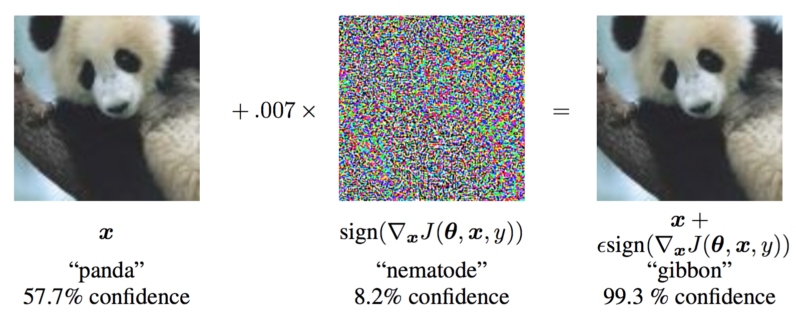
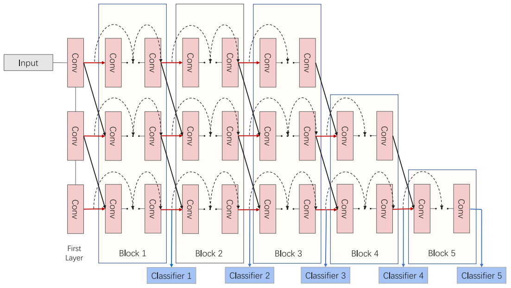
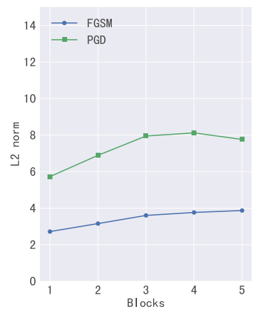
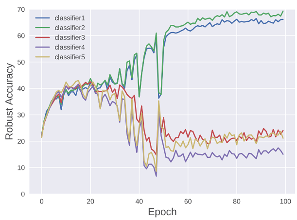

# Towards improving fast adversarial training in multi-exit network \[Kor\]

Chen et al./ Towards improving fast adversarial training in multi-exit network / Neural Networks 2022

## 1. Problem definition

이미 2015년에 CNN이 인간보다 이미지 분류를 더 잘 할 수 있다는 것다는 것을 보여주었습니다. 하지만 신경망에 심각한 취약점이 있다는 것이 밝혀졌습니다. 이미지에 계산된 noise를 삽입하면 원본 이미지와 구분되지 않는 이미지를 오분류하게 만들 수 있다는 것이었습니다. 이를 적대적 공격(adversarial attack)이라 하고, 이를 통해 생성된 이미지를 적대적 예제(adversarial example라고 합니다.

많은 연구자들은 이러한 취약점을 해결하기 위해 수많은 연구를 했지만, 적대적 예제를 실시간으로 신경망에 학습시키는 것 외에는 뾰족한 수가 없다는 것으로 의견을 모으게 됩니다. 이를 적대적 학습(adversarial training)이라고 부르고 이를 통해 신경망을 강건(robust)하게 만들 수 있다는 것이 밝혀졌습니다.

그러나 적대적 학습에는 문제가 있습니다. 적대적 학습을 하려면 적대적 예제를 실시간으로 만들어줘야 하는데, 정밀한 예제를 만드는데 오랜 시간이 걸린다는 것이었습니다. 적대적 학습은 일반적인 학습 보다 7~30배씩 걸려 CIFAR-10을 학습하는 데만 4일씩 걸립니다. 이로 인해 몇몇 연구는 적대적 학습에 필요한 시간을 줄이기 위한 연구에 집중하기 시작했습니다. 오늘 소개하는 논문은 그러한 연구 중 하나입니다.

연구 목표: 적대적 학습에 필요한 시간을 단축

## 2. Motivation

### Related work

#### 1. Adversarial Attacks

Fast Gradient Sign Attack(FGSM)

가장 간단하게 적대적 예제를 만드는 방법으로, 이미지를 더 큰 Loss값이 나오도록 업데이트합니다. Loss를 이미지에 미분하여 Loss가 증가하는 방향을 구하고 원본 이미지에 ϵ만큼 픽셀 값을 더해줍니다.

$$
x~=x+ϵ⋅sign(∇xJ(w,x,y))

$$

Projected Gradient Descent(PGD)

FGSM과 비슷하게 이미지를 Loss가 증가하도록 업데이트 합니다. FGSM에서는 한번만 업데이트 하는 데 반면에 PGD에서는 n번 반복하여 적대적 예제를 생성합니다. 따라서 더 정밀한 적대적 예제를 만들 수 있습니다. 하지만 이미지의 Loss를 구하고 업데이트 하는 과정에서 forward pass와 backward pass를 반복해야 하기 때문에 계산량이 많이 증가합니다.

$$
x_t+_1 = Π_x+_S(x^t + αsign(∇xJ(w,x,y)))

$$

##### 2. Adversarial Training

FGSM을 이용해 Adversarial Training을 하게 되면, FGSM와 같은 약한 공격에만 강건해지고 다른 공격은 막지 못하는 것이 확인되었습니다. 반면에 PGD 공격과 같이 강한 공격으로 학습 시키면 PGD 공격 뿐만 아니라 다양한 공격에 대해서도 강건하다는 것을을 보였습니다. 따라서 PGD를 이용한 Adversarial Training이 기본적인 학습 방법으로 자리잡게 되었습니다. 다만 앞서 언급했듯이 PGD로 적대적 예제를 생성해야 함으로 인해 학습 시간이 7~30배씩 증가했습니다.

추가적 연구를 통해 FGSM을 이용해도 강건한 신경망을 만들 수 있다는 것이 밝혀졌습니다. FGSM으로 Adversarial Training을 하면 gradient masking이나 catastrophic overfitting이 문제가 된다고 합니다. Gradient masking 현상은 신경망이 강건해지지 않았지만 적대적 예제를 만들기 어렵도록 gradient가 변하게 되어 거짓된 강건함을 보이는 것이고, catastrophic overfitting은 학습이 진행되며 강건성이 증가하다가 어느 시점부터 FGSM에 overfitting되어 강건함이 0이 되는 현상을 가르킵니다.

##### 3. Multi-exit Network

###### MSDnet

저자는 그 해결책 중 하나로 Multi-exit Network를 제시합니다. MSDnet은 연산을 효율을 위해 결과가 출력되는 위치를 여러 곳으로 만들었습니다. 출력되는 위치는 얕은 레이어에서 깊은 레이어까지 있는데 분류가 쉬운 이미지가 입력되면 앝은 곳에서 confidence가 충분히 높아져 더 깊은 레이어까지 연산이 되지 않아도 결과를 출력할 수 있게 됩니다. 뒤에 레이어가 깊어질수록 catastrophic overfitting에 취약해진다는 점을 보이는데, MSDnet가 얕은 연산으로도 결과값을 출력한다는 점을 이용합니다.

### Idea

**FGSM을 이용해 Adversarial Training을 효율적으로 함과 동시에 Multi-exit Network과 regularization을 이용해 catastrophic overfitting을 해결**

## 3. Method

저자는 오버피팅이 일어나는 이유를 두가지를 꼽습니다. 첫번째로는 모델의 깊이입니다. 아래의 왼쪽 그림은 clean 이미지를 입력했을 때의 feature와 적대적 예제를 입력했을때의 feature간의 거리입니다(L2 norm). 거리 차이가 클수록 모델의 feature가 공격에 크게 반응한다는 것입니다. 그리고 PGD가 FGSM보다 거리가 큰 것으로 보아 PGD 공격이 더 강하다는 것을 확인할 수 있습니다. 깊이가 깊어질수록 더 크게 반응하는 것을 확인할 수 있습니다. 아래 오른쪽 그림은 적대적 학습이 진행될수록 정확도가 어떻게 변하는지를 보입니다. 여기서 확일 할 수 있는 것은 깊이가 낮은(classifier 1,2)에 비해 깊이가 깊은(classifier 3,4,5)가 어느 시점 이후부터는 정확도가 떨어진다는 것입니다. 즉 깊이가 깊어질수록 catastrophic overfitting 에 취약하다는 것입니다. 따라서 Multi-exit network를 사용하면 얕은 classifier을 통과하는 예제에 있어서는 과적합을 피해 높은 정확도를 유지할 수 있다는 것이 저자의 아이디어입니다.

저자는 두 번째 원인이 fully connected layer의 weighs에 있다고 주장합니다. 저자는 weights의 분산이 작을수록 적대적 공격에 취약하다는 것을 보입니다. 따라서 fully connected layer에 l2 정규화를 하여 분산을 높여 적대적 예제에 대한 반응을 낮추는 동시에 과적합의 영향력을 줄입니다. 이때 언더피팅을 피하기 위해서 적당한 가중치를 설정하는 것이 중요하고, 더 깊은 네트워크일수록 가중치를 높였다고 합니다.

##### HyperParameters
CIFAR-10에서는 SGD optimizer를 사용하고 모멘텀을 0.9로 설정하여 100에폭만큼 학습시켰습니다.
그리고 MSDnet(block=5) 사용
CIFAR-100에서는 MSDnet(block=7)을 사용했고,  FC에서 L2 regulization에서는 λ = [0.1, 0.1, 0.1, 0.15, 0.15, 0.15, 0.15] 를 사용했습니다.

## 4. Experiment & Result

##### Dataset

Imagenet은 학습시간이 너무 길어 벤치마크가 거의 없습니다. 따라서 CIFAR-10, CIFAR-100, SVHN 데이터셋에서 실험을 진행합니다. 여기서는 CIFAR 데이터셋 result만 소개하겠습니다.

##### Results

우선 CIFAR 10 데이터셋에 대한 정확도를 비교해봅시다. "Standard"는 공격하지 않은 원본 데이터에 대한 정확도를 나타내고, 나머지 각 Column은 공격 방법이고, (%)는 각 공격에 대한 정확도입니다. 따라서 다양한 공격에 대해 정확도가 높을수록 robustness가 높습니다.

우선 정확도부터 비교 해 보면 대체로 SotA 모델에 비해 비슷하거나 더 높은 것을 확인 할 수 있습니다. 특히 가장 강력한 공격으로 할려진 AA(Auto Attack)에 대해 높은 정확도를 보인 것은 괄목할만한
결과입니다. 가장 강건한 모델 중 하나로 알려진 TRADES 보다 학습시간이 반절밖에 안된다는 점이 눈여겨볼 점입니다. 반면에 Free-8 방법에 비해서는 학습 시간이 약 세배정도 걸리는 것을 볼 수 있는데, 저자의 방법이 모든 공격에 대해 강건하다는 것을 확인할 수 있습니다.

다음은 CIFAR 데이터셋에서 정확도를 살펴봅시다.

먼저 눈에 띄는 점은 TRADES 방법에 비해 조금 뒤진다는 것입니다. 하지만 학습시간 반절이라는 점을 고려하면 제안한 방법에도 장점이 있다고 볼 수 있습니다. 저자는 Free-8 방법과 Fast FGSM 방법은 학습 시간은 덜 걸리는 반면에 공격 방식이 gradient based(CW-100 공격 방식과는 다름)인 것만 잘 막는다는 단점이 있다고 합니다.

전반적으로 안타까운 점은 적대적 학습 SotA 모두 CIFAR-100이라는 ImageNet과 같은 데이터셋보다는 비교적 단순한 데이터에 대해서도 낮은 방어율을 보인다는 것입니다. 이는 아직도 강건한 신경망을 만들기 위한 길은 한참 남아있다고 볼 수 있겠습니다.

## 5. Conclusion

저자는 PGD 적대적 학습 방법의 속도 개선을 위해 FGSM을 사용하고 그에 따른 catastrophic overfitting 을 해결하기 위해 Multi-exit 네트워크를 사용하였고, 깊은 네트워크에서 적대적 공격에 강건하게 하기 위해 Fully connected layer에 l2 regularization을 추가했습니다.

이를 통해 가장 강건한 학습 방법인 TRADES와 비슷한 정확도를 보이면서도 학습시간을 반으로 줄일 수 있었습니다.

### Take home message \(오늘의 교훈\)

심층 신경망이 우리 생활에 가까워짐에 따라 강건한 모델의 필요성이 더욱 커지고 있다. 하지만 그나마 효과가 있다고 하는 적대적 학습 방법은 계산량이 매우 큰데 비해 정확도는 실망스러워 보이기도 한다. 신경망의 강건성을 획기적으로 높일 수 있는 획기적인 방법은 없을까?

## Author / Reviewer information


You don't need to provide the reviewer information at the draft submission stage.


### Author

**전우진 \(Woo Jin Jeon\)**

* KAIST Electrical / CILAB
* woojin.jeon337@gmail.com

### Reviewer

1. Korean name \(English name\): Affiliation / Contact information
2. Korean name \(English name\): Affiliation / Contact information
3. ...

## Reference & Additional materials

1. Madry, Aleksander, et al. “Towards Deep Learning Models Resistant to Adversarial Attacks.”  ICRL 2017
2. Goodfellow, Ian J., et al. “Explaining and Harnessing Adversarial Examples.”  *ArXiv.org* , 2014
3. Chen, Sihong, et al. “Towards Improving Fast Adversarial Training in Multi-Exit Network.”  *Neural Networks* , vol. 150, June 2022
4. Huang, Gao, et al. “Multi-Scale Dense Networks for Resource Efficient Image Classification.”  ICRL 2018

‌

‌

‌

‌
